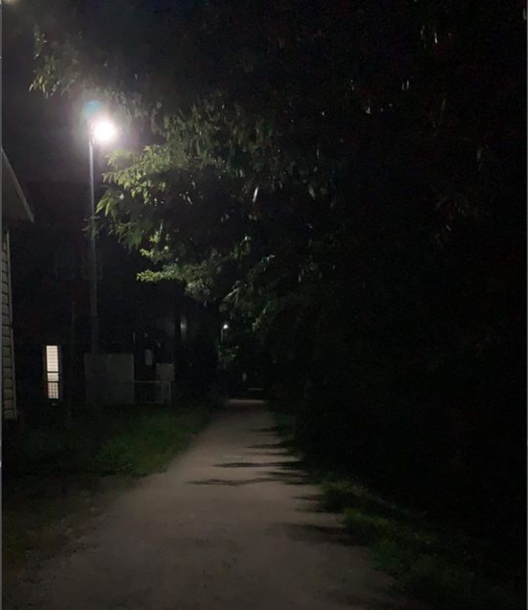
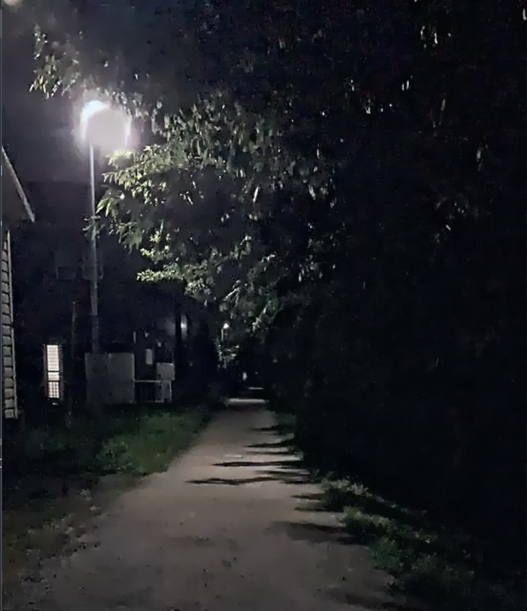

# **🌙 Improving Illumination in Night Time Images**  

## **📜 Overview**  
This project enhances nighttime images by improving visibility, contrast, and reducing noise using a dehazing-based algorithm. The program utilizes **Guided Image Filtering** and **Atmospheric Light Estimation** techniques for image enhancement.  

## **⚙️ Requirements**  
Ensure you have the following dependencies installed before running the program:  
- 🐍 Python   
- 📷 OpenCV (`cv2`)  
- 🔢 NumPy  
- 🖥️ Tkinter  

Install dependencies using:  
```sh
pip install opencv-python numpy
```

## **🚀 Usage**  
1. **Run the script**:  
   ```sh
   python Improving_Illumination.py
   ```  
2. **📂 Select an image** using the file dialog window.  
3. The program processes the image and displays:  
   - 🏞️ **Original Image**  
   - ✨ **Enhanced Image Versions**  
4. **Close the windows** to finish execution.  

## **🧠 Algorithm Flow**  
The enhancement process consists of the following steps:  
1. **🔦 Illumination Channel Estimation**: Determines the brightest and darkest regions of the image.  
2. **☀️ Atmospheric Light Estimation**: Identifies the global illumination.  
3. **🌫️ Transmission Map Estimation**: Computes the transmission factor to correct the image.  
4. **🎨 Guided Image Filtering**: Smooths the transmission map while preserving edges.  
5. **🖼️ Final Image Reconstruction**: Restores the image with improved visibility.  

## **📊 Example Output**  
### 🖼️ **Original vs. Enhanced Image**  
Original Image | Enhanced Image  
--- | ---  
 |   

## **📁 Project Structure**  
```
📂 Improving_Illumination/
├── 📜 Improving_Illumination.py  # Main script
├── 📂 assets/                    # Image assets
│   ├── original.png              # Sample input
│   ├── enhanced.png              # Sample output
└── 📜 README.md                  # Documentation
```

## **🙏 Acknowledgments**  
This project is inspired by research on **image dehazing and low-light enhancement techniques**.  

---

Let me know if you'd like any modifications! 🚀
